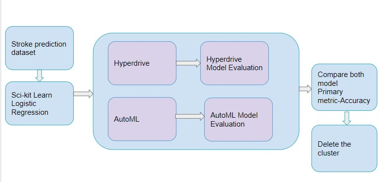
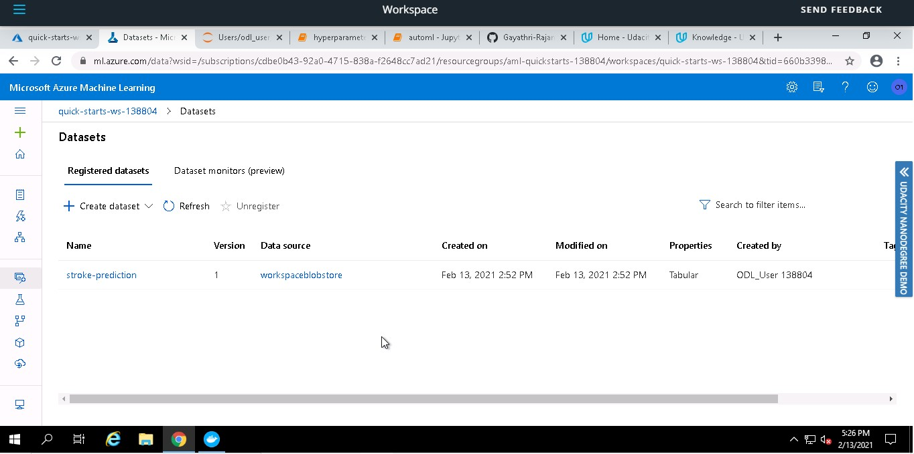
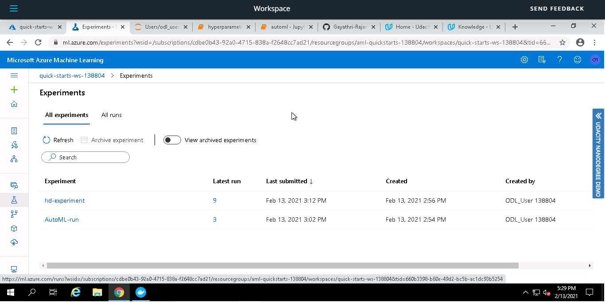
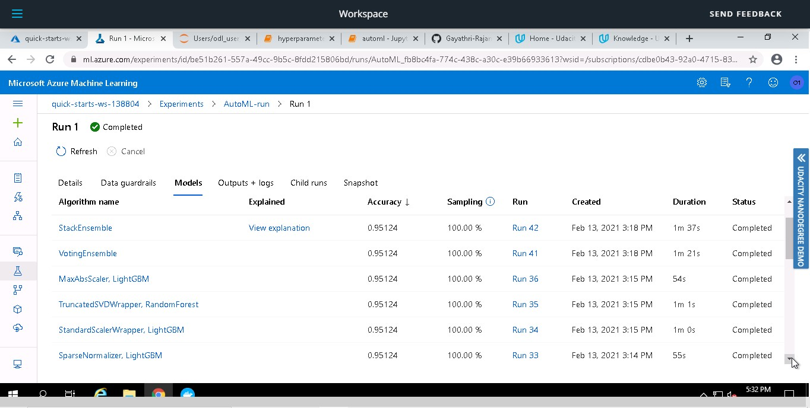
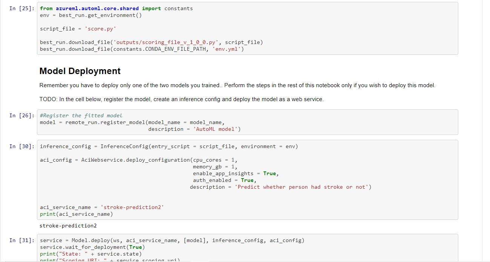
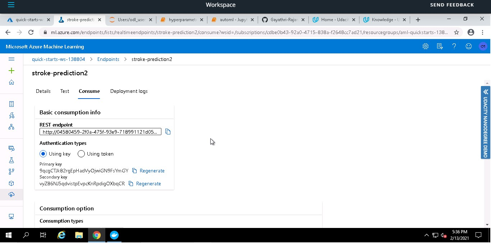
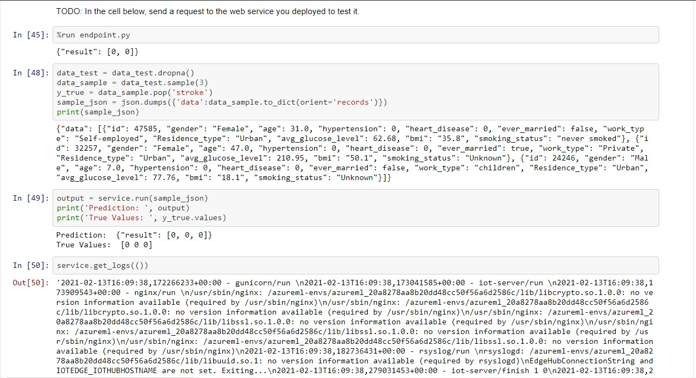

# HEART STROKE PREDICTION

## Project Overview

In this project two different models are created for the Stroke prediction dataset. The first one is using AutomatedML and second one is made using Hyperdrive and the hyperparameters are tuned. Based on accuracy, the model with better accuracy is deployed later.

## Project Set Up and Installation
I have used the project workspace which was given as a part of this course. You need an Azure Suscription and you log in using the credentials.

## Dataset

### Overview
The dataset that I have used for this project is from Kaggle. The dataset is [Stroke Prediction](https://www.kaggle.com/fedesoriano/stroke-prediction-dataset). 

According to the World Health Organization (WHO) stroke is the 2nd leading cause of death globally, responsible for approximately 11% of total deaths. This dataset is used to predict whether a patient is likely to get stroke based on the input parameters like gender, age, various diseases, and smoking status. Each row in the data provides relavant information about the patient.

### Task

In this project, Azure AutoML and HyperDrive method will be used to make prediction on the death event based on patient's 10 clinical features.

1) id: unique identifier

2) gender: "Male", "Female" or "Other"

3) age: age of the patient

4) hypertension: 0 if the patient doesn't have hypertension, 1 if the patient has hypertension

5) heart_disease: 0 if the patient doesn't have any heart diseases, 1 if the patient has a heart disease

6) ever_married: "No" or "Yes"

7) work_type: "children", "Govt_jov", "Never_worked", "Private" or "Self-employed"

8) Residence_type: "Rural" or "Urban"

9) avg_glucose_level: average glucose level in blood

10) bmi: body mass index

11) smoking_status: "formerly smoked", "never smoked", "smokes" or "Unknown"*

12) stroke: 1 if the patient had a stroke or 0 if not

### Access

First, the data is dowloaded as csv file from Kaggle. It is then uploaded to the workspace using the local files option It is then accessed using the code <dataset = Dataset.get_by_name(ws, 'stroke-prediction')>

### Uploaded Dataset
The following screenshot shows that the dataset has been uploaded.

### Experiments

The first experiment was conducted using AutoML and after that HyperDrive. The below sceenshots show the list of experiments.

## Automated ML
At first the Automated ML part is carried out. 
The following screenshot shows the AutoML configuratio that I have chosen.

The Experiment time out is set up so that the entire resources doesn't get used up. I hae set it to 30 minutes. The primary metric that I hae chosen in order to evaluate the result is Accuracy. The maximum number of concurrent iterations has been set to 4.

AFter setting the AutoML configuration, the experiment is submitted. Classification is done on the target cloumn, stroke. It is represented as [0,1].The experiment tries out various different models. Finally it will give us the model with best Accuracy.

#### AutoML Run details Widget
The screenshot shows the run details of AutoML

#### AutoML Run Completed
The below screen shows that the AutoML has completed its run

#### Models
The sceenshot shows the Run details of the AutoML run. It shows the various models through which it performed.

### Results
#### Best model
The best model from AutoML run is Stack Ensemble. It has an accuracy of 0.95124. The screenshot shows the details of the best model-stac ensemble

#### Paramteres
The following screenshots show the various other metrics of the best model Stack Ensemble.

The following screenshots shows the best_run and fitted model.

## Hyperparameter Tuning

As it is a binary classification problem, the model used for HyperDrive is Logistic Regression.

 -It is easy to understand
 - Trains very easily and faster compared to complex models

The parameters used for hyperparameter tuning are:

 - Regularization Strength (C) with range 0.1 to 1.0 -- Inverse of regularization strength. Smaller values cause stronger regularization
 - Max Iterations (max_iter) with values 50, 100, 150 and 200 -- Maximum number of iterations to converge
 
The sampling method I used in RandomSampling. It supports both discrete and continuous values. It supports early termination of low-performance runs. In Random Sampling, the values are selected randomly from a defined search space.

With the help of Early Termination policy, we can terminate poorly performing runs. The policy that I chose is BanditPolicy. Bandit Policy is based on slack factor/slack amount and evaluation interval. This policy will terminate runs whose primary metric is not within the specified slack factor/slack amount. By using this policy we could improve the computational efficiency.

For the Hyperdrive Configuration the Primary metric chosen is Accuracy, Max concurrent run is 4 and Max total run is set as 100.

#### Run Configuration
The screenshot shows the configuration that I have chosen to run HYperDrive

 
 
 #### Run Details Widget
 
 The following screenshots show the run details widget of the HYperDrive Run.
 
 

The various runs which have been completed.

The graphs associated with the run showing --C, --max_iter and Accuracy

#### Run completed

The screenshot shows that the run has been completed.

### Results
#### Best Run

The following two screenshots show the best run from the HyperDrive part. One is seen in the Python SDK and other in the Azure Studio. The best model has a Accuracy of 0.940313, Regularization Strength 0.8645, Max iterations 50.

## Model Deployment

The Accuracy of AutoML is slighlty better than the HyperDrive run. Therefore the AutoML model is deployed.

The AutoMl model is deployed using Azure Container Instance as a WebService. Best run environment and score.py file is provided to the InferenceConfig. Cpu_cores and memory_gb are initialized as 1 for the deployment configuration. The aci service is then created using workspace, aci service name, model, inference config and deployment configuration.

The model is successfully deployed as a web service and a REST endpoint is created with status Healthy. A scoring uri is also generated to test the endpoint.

#### Deployment 
The follwoing screenshot shows that the best run environment and score.py file is provided.

#### Status : Healthy

The screenshot shots that the deployement has bee successful. It has the status 'Healthy'

#### Application Insights
The application insights is enabled to be true. The below screenshot shows that and the application insights URL

The below screenshots the various graphs that could help us to analyse using the application insights URL. It includes failed requests, server esponse time, server requests etc.

#### Consume
From the endpoints section, we can also get the Rest Endpoint and Primary Key. These two values are copied and subsituted in the endpoint.py file. Then it is tested using two methods. The screenshot below shows the consume tab.

#### Testing

The below screenshot shows the ways by which the model is tested

## Screen Recording
 [Link](https://youtu.be/SEboSV62dKE) to screen recording
 
 ## Future Improvements
 
 - Larger dataset could be used for better results
 - Other hyperparameters can be used to see if the metrics are getting affected

